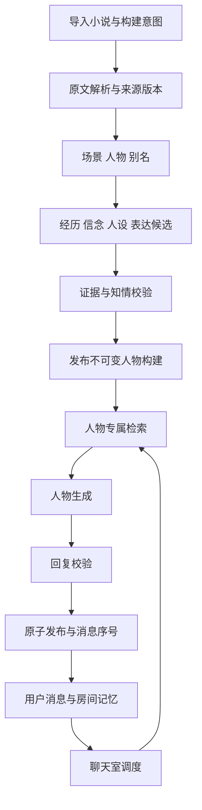
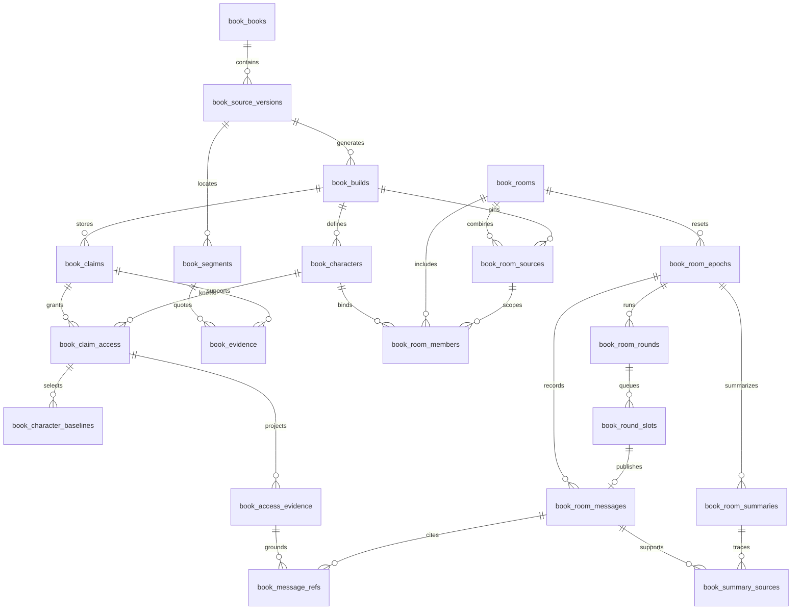

# Octopus 书籍人物 Agent 与多人聊天室详细设计

版本：首版设计草案，已复核 Agent 理论依据并补充主题 / 自由聊天。日期：2026 年 10 月 10 日。

本设计从书籍建立有原著依据的人物 Agent，支持同一工作区内多部书的人物进入同一聊天室。每个成员绑定自己的来源与人物构建，公共交流共享，原著知识与核心人设保持独立。复用现有图书馆的书目、附件、模型配置和 WebSocket；新增人物构建、视角受限的证据检索、人物运行时与聊天室调度。实施顺序及逐项任务见[实施计划](F:/god/project/Octopus/docs/plans/book-character-agents/implementation-plan.md)。

## 产品约束与首版范围

已确认的规则：

- 人物可使用全书中自己亲历或获知的内容，不按读者阅读进度限制。
- 人物记住本聊天室交流，原著事实、核心人设与原著关系不被聊天覆盖。
- 原著事实、人物信念、房间内听说与模拟推演分别记录。
- 同一工作区内允许跨书人物混聊；原著授权仍按成员的书籍、来源、构建和人物限定，公共交流按房间与记忆代数共享。
- 每个房间中每本书固定一个人物构建；跨工作区群聊不进入首版。
- 新增独立“人物聊天室”Tab，左侧为林间风格 3D 圆桌，人物固定落座，右侧为完整对话栏；头顶气泡与已发布消息同步。
- 讨论方式为自由聊天 free 或主题聊天 topic；发言方式仍为 natural / directed / all。两层可组合，均遵守原著约束和有限轮次。

首版设计默认值：人物采用最后有原著证据支持的状态；新情境的短暂情绪允许依据原著推演；从文本可提取的 PDF 开始；导入时选择“小说”后默认勾选自动构建，其他资料默认不勾选。旧导入请求没有新增字段时维持原行为。上述默认值属于本次细化的设计选择。

范围内包括全文来源定位、人物及别名、人物证据档案、自动生成逻辑 Agent、单聊、跨书多人定向与自然回应、全体提问、房间记忆、停止与重启恢复、圆桌场景与头顶气泡。EPUB 与 TXT、向量检索为后续增强任务。OCR、语音、头像生成、地图、按章节扮演、私聊与关系持续演化不进入首版；私密知识隔离从第一阶段实现。

所有有可区分身份的人物进入名单。证据稀疏人物可对话，但不能补造完整人格；名称未消歧的人物暂不启用。自动提取的名单完整性属于质量目标，不能承诺任意小说都能零遗漏。

## 用户行为

1. 导入小说后，书目立即出现，原文解析与人物构建分别显示状态。
2. 人物页面显示名单、别名、公开简介、证据状态及 Agent 是否可用。
3. 人物详情显示其原著经历、观念、关系与典型表达，依据可跳转到原文。这里是读者视图，可查看人物的私密依据。
4. 用户可从独立“人物聊天室”Tab 创建和恢复房间；书目的人物入口可跳转到同一界面。单聊与多人房间采用同一圆桌页面，人物分别坐在固定位置。
5. 可从多部书选择人物，成员选择器和发言显示书籍标签；点名由明确的 member_id 定向回复，自然模式默认至多三人，全体模式按成员快照逐人处理。
6. 每个成员可设为正常参与、仅 @ 时回应或禁言，也可从本房间移除；控制操作不改变原著与其他房间。
7. 用户可停止当前轮、继续尚未完成的全体队列或重置房间记忆。新房间从原著基线开始。
8. 右侧显示完整消息、@ 输入和剩余秒数；生成期间人物头顶显示状态，校验发布后同步渐显气泡。点击人物可 @、禁言或移除，点击气泡可定位完整消息。

人物说“甲刚刚告诉我”表示房间记忆，说“当时我亲眼看到”必须有其原著亲历依据。原著没有记载的情境回答标为推演，不被写入原著档案。

## 人物聊天室入口与圆桌界面

新增“人物聊天室”Tab，与“林间图书馆”并列，路由建议 /book-rooms 与 /book-rooms/:roomId。顶部选择或创建房间，添加来自不同书籍的人物；桌面左侧为圆桌场景，右侧为可调宽度的完整消息和输入栏。布局、人物状态、气泡规则和降级验收见[圆桌交互设计](F:/god/project/Octopus/docs/plans/book-character-agents/roundtable-ui-design.md)。

场景复用现有 Babylon.js 技术及林间图书馆的圆形木桌、软垫椅、暖木色板、植物、暖光和环绕相机。每个在场成员使用独立的简化坐姿模型，名牌显示人物和书籍；原著未描写的外貌采用中性模型。默认略俯视，可旋转、缩放和恢复全景，点击角色可聚焦并打开 @、禁言或移除操作卡。

成员以 member_id 对应 seat_index，座位由服务端分配并持久化。禁言保留人物，移除或来源失效保留空椅，重返和记忆重置不重新排序；容量不足仅在房间无活跃轮次时扩展。默认 8 座是展示容量，不能成为成员或全体发言数量上限。

头顶气泡使用角色 head_anchor 的屏幕投影及 DOM 文字层，右侧消息和气泡由同一 Hook 状态驱动。原始生成 token 仍内部缓冲；先显示“正在回应/校验”，校验并原子发布后，根据同一 message_id/seq 在两处同步呈现已批准正文。长文本在气泡内收起并链接完整消息，首版逐字显示是已校验文本的动画。

场景只获取公开人物身份、成员状态、当前槽位和公开消息，不能读取私密人格或原文上下文。有限轮次、秒数上限、@、禁言和移除均由服务端既有规则控制。窄屏、减少动态效果或 WebGL 失败时保留二维成员入口和完整对话操作。

本项属于设计新增，实施为 T16；当前尚未创建生产聊天室 Tab 或圆桌代码。

## 现有系统接入与存储位置

| 接入位置 | 当前事实 | 新能力接入方式 |
| --- | --- | --- |
| [LibraryHandler](F:/god/project/Octopus/backend/channels/desktop/handlers/library.py:112) | 创建书目后后台处理 PDF | 在书目 metadata 中持久化小说类型与自动构建意图，构建工作器等待来源就绪 |
| [LibraryEngine](F:/god/project/Octopus/backend/services/library_engine.py:312) | 复制附件、计算哈希和提取片段 | 复用附件身份，新增叙事解析结果；不使用现有 100 片段默认限制处理全文 |
| [知识索引迁移](F:/god/project/Octopus/backend/services/knowledge_migrations.py:627) | 工作区知识数据库有独立迁移序列 | 新功能表注册到该序列，实施时取最新编号 |
| [全局 Database](F:/god/project/Octopus/backend/data/database.py:45) | 默认使用 app.db | 保存模型及秒数默认偏好；人物与房间仍在工作区库 |
| [HandlerRegistry](F:/god/project/Octopus/backend/channels/desktop/handlers/registry.py:210) | 注册 WS Handler 并启动后台服务 | 注册 book_world 与 book_room Handler，管理其启动和停止 |
| [LLMProvider](F:/god/project/Octopus/backend/core/providers/base.py:45) | 提供 chat 与 chat_stream 接口 | 复用 provider factory；不假设已有通用 JSON Schema 输出参数 |
| [LibraryItemDetail](F:/god/project/Octopus/frontend/src/pages/Knowledge/library/LibraryItemDetail.jsx:28) | 已有书目详情和 PDF 入口 | 增加人物与聊天室入口，跳转统一房间页面 |
| [App 导航与路由](F:/god/project/Octopus/frontend/src/App.jsx) | 已有独立林间图书馆入口 | 增加人物聊天室 Tab、房间路由与刷新恢复 |
| [LibrarySceneCanvas](F:/god/project/Octopus/frontend/src/pages/Knowledge/library/scene/LibrarySceneCanvas.jsx) | 已使用 Babylon.js 构造木桌、椅子、坐姿人体与相机 | 提取适量共享构件，独立实现圆桌，不复用书架业务状态 |

权威数据统一存于当前工作区 knowledge/.knowledge_index.db；规范化全文与可重建的人物展示文件位于书目目录的 narrative 子目录。模型凭据仍由现有全局配置管理，不复制到人物档案、任务日志或配置快照。全局 provider_id、model_id 是逻辑引用，没有跨数据库外键。

每个请求由服务端获取规范化工作区身份并绑定服务实例。运行中的任务捕获固定根路径，不能在阶段执行时改读全局“当前工作区”；切换工作区后旧事件不得进入新界面。保存的数据时间统一使用 UTC，界面按用户时区展示。

人物是书籍绑定的逻辑 Agent，持久化身份、人物构建版本和模型策略；按需共享模型服务。首版不批量写入通用 subagents 列表。

## Agent 理论依据与复核结果

理论映射、文献出处和边界见[Agent 复核报告](F:/god/project/Octopus/docs/plans/book-character-agents/agent-design-review.md)。BDI 支持把人物信念、动机/目标和本次行为意图区分；情绪评价理论支持依据事件与人物价值生成短暂反应；Generative Agents 与 BookWorld 为记忆驱动角色和小说人物互动提供研究参考；话轮组织与 AutoGen 支持把选人和停止条件分开。

本设计采用这些思想的轻量组合，尚不是完整的 BDI/OCC 实现。已有知识、固定基线、房间记忆与调度分工；复核补充有依据的动机/价值槽位、本次对话行为和情绪触发引用。无法从书中抽取的项保持 unknown，不能为填满人格模型而虚构设定。

人物动机和价值优先级由本人已授权的 trait、belief、relation 等断言构成，存入基线槽位和带依据的 runtime_policy；不改 claim 的事实类别。对话行为可为回答、询问、质疑、安慰、回避或沉默，是本次运行意图，不写成原著经历。短暂情绪以本 epoch 的触发消息和本人的原著模式为依据，校验通过后才更新成员状态，重置时清除。

允许集限制的是取证与上下文，不能消除模型预训练参数中的知识。发布校验和真实模型评测必须继续检查原著未知信息、错误前提、跨书知识诱导及过度拒答；数据库结构测试不证明人格或自然语言语义已完全正确。

## 模块与接口

以下模块及接口均为拟新增设计。服务采用显式依赖注入，数据库、解析器、模型适配器、时钟和取消信号可替换。

| 模块 | 公开操作 | 保证的边界 |
| --- | --- | --- |
| BookSourceService | prepare_source、list_segments、resolve_evidence | 全文覆盖，稳定来源位置，分批读取 |
| BookBuildService | request_build、get_build、cancel_build、retry_build | 持久状态、版本快照、断点与发布原子性 |
| CharacterCatalogService | list_characters、get_character、create_revision | 人物身份、公开与读者详情分开，修订不改旧版本 |
| CharacterKnowledgeService | retrieve、get_allowed_evidence | 身份在服务端绑定，允许集内检索，无结果不扩大范围 |
| BookCharacterRuntime | respond | 人设固定，只接收受限原著依据与可见房间消息 |
| CharacterReplyValidator | validate | 检查引用权限、事实支持、信息类型与人格约束 |
| BookRoomService | create、list_messages、submit_turn、reset | 房间版本固定、序号与幂等、记忆隔离 |
| RoomCoordinator | plan_round、run_round、pause、resume、stop | 单房间顺序发言、队列可恢复、过期任务不能发布 |
| useBookRoom / BookRoomScene | 读取快照、合并已发布消息、投影公开场景状态 | 右侧与气泡共用消息身份；renderer 不决定发言或读取原著 |

人物运行时不继承通用文件、命令、网络、全局记忆或其他人物私有工具。首版由服务预检索并组装上下文，模型不自主选择知识范围。后续若增加人物检索工具，也必须使用同一身份绑定接口。

构建使用当前图书馆提取配置，人物生成使用选定的聊天配置，校验默认复用聊天提供商。配置在构建或房间创建时保存非敏感快照；执行前重新解析凭据。模型配置失效时报告 provider_unavailable，用户重新选择后创建新策略版本，避免静默替换。

## 架构与数据流



构建工作器可以读当前来源的完整原文；人物模型只能看经批准的视角材料。读者查看依据的接口与人物取证接口分离。完整场景可能包含旁白秘密，不能因人物在场就整个注入。

## 存储维度与术语

物理数据库按工作区隔离，一个工作区继续使用一份 knowledge/.knowledge_index.db。书籍和人物共享该库，库内按书籍、来源版本、人物构建、人物及聊天室组织数据。字段类型、默认值、CHECK、外键、索引和保护触发器的完整定义见[SQL 结构草案](F:/god/project/Octopus/docs/plans/book-character-agents/storage-schema.sql)。该附件可在内存库验证，尚未注册为应用迁移。

| 维度 | 稳定标识 | 数据范围 |
| --- | --- | --- |
| 工作区 | 服务端绑定的规范化根路径与数据库连接 | 所有来源、人物与聊天室；不从客户端路径或局部 ID 推断数据库 |
| 书籍 | book_id，人物模块 UUID；library_item_id 映射现有书目 | 删除书目后保留身份元数据；名称与文件名不作为标识 |
| 来源版本 | source_version_id | 具体附件与解析器产生的原文、片段和证据定位 |
| 人物构建版本 | build_id | 特定来源、提取配置与策略产生的不可变人物和知识 |
| 人物 | character_id | 当前构建中的人物身份、信念、基线与知情权限 |
| 房间 | room_id | 多个来源构建的成员及公共交流；同一人物可进入多个房间 |
| 记忆代数 | epoch | 一次房间重置之间的消息、摘要、轮次与听说引用 |

lineage_id 仅用于人物修订跟踪，不能用于授权或跨版本取知识。跨人物构建的原著授权仍禁止；跨书公共发言可以成为本房间听说，但不能升级为自己的原著经历。同一来源的多个构建可以共享原文片段。不同译本、修订版及解析结果使用不同来源定位。领域定义见[书籍人物词汇](F:/god/project/Octopus/docs/plans/book-character-agents/CONTEXT.md)。

以下简称 B 为 book_id、source_version_id、build_id；简称 R 为 room_id、epoch。鉴权用 B 和 R 必填，不允许通过 NULL 绕开复合外键；SQLite 在复合子键任一列为 NULL 时可能不要求对应父记录，因此可空列仅用于明确的可选关系。[SQLite 外键规则](https://www.sqlite.org/foreignkeys.html)

## 表结构与关联关系

### 字段约定

实体 ID 为显式 NOT NULL 的 TEXT UUID，现有 library_item_id 为 INTEGER。计数、布尔、代数、序号与偏移采用 INTEGER 加 CHECK。时间统一为 UTC ISO 8601 文本；SHA-256 由应用计算并验证，数据库不承担哈希或自然语言语义证明。

偏移从零开始，按 Unicode 码点计数，右端不包含。segment.start_offset/end_offset 基于固定规范化全文；evidence.local_start/local_end 基于所属片段，全书位置为片段起点加本地偏移。前端不得直接用 UTF-16 字符下标替代码点定位；PDF 页内位置另行记录。

配置、公开简介、故事时间、候选检查点与摘要正文可保存 JSON。用于关联和鉴权的实体引用已拆为关系表；identity_snapshot 与 display_snapshot 仅供历史展示，不可作为模型事实来源。

### 数据表字段

| 表 | 字段 |
| --- | --- |
| book_books | id、library_item_id、title_snapshot、lifecycle_state、created_at、removed_at |
| book_source_versions | id、book_id、attachment_sha256、parser_version、canonical_text_sha256、asset_rel_path、text_rel_path、format、lifecycle_state、quality_json、created_at |
| book_segments | id、book_id、source_version_id、ordinal、page、chapter、start_offset、end_offset、text、text_sha256 |
| book_builds | id、book_id、source_version_id、parent_build_id、build_fingerprint、status、stage、lifecycle_state、config_snapshot_json、policy_version、cancel_requested、lease_owner、lease_generation、lease_expires_at、error_code、error_detail、created_at |
| book_build_steps | book_id、source_version_id、build_id、stage、unit_key、input_hash、status、result_json、attempts、lease_generation |
| book_scenes | id、book_id、source_version_id、build_id、narrative_order、story_time_json、location_label |
| book_scene_segments | book_id、source_version_id、build_id、scene_id、position、segment_id |
| book_characters | id、book_id、source_version_id、build_id、lineage_id、name、agent_status、public_profile_json、runtime_policy_json、created_at |
| book_character_aliases | book_id、source_version_id、build_id、character_id、alias、normalized_alias、review_state、provenance_json |
| book_scene_characters | book_id、source_version_id、build_id、scene_id、character_id、presence |
| book_claims | id、book_id、source_version_id、build_id、kind、owner_character_id、proposition、truth_state、interpretation_level、support_state、scene_id、supersedes_claim_id、search_terms |
| book_evidence | id、book_id、source_version_id、build_id、claim_id、segment_id、local_start、local_end、quote_text、quote_hash、support_state |
| book_claim_access | book_id、source_version_id、build_id、character_id、claim_id、route、acquisition_scene_id、disclosure、access_state |
| book_access_evidence | book_id、source_version_id、build_id、character_id、claim_id、evidence_id、approved_excerpt、visibility_state |
| book_character_baselines | book_id、source_version_id、build_id、character_id、slot_key、claim_id |
| book_rooms | id、title、current_epoch、next_seq、status、policy_snapshot_json、scene_layout_version、scene_capacity、discussion_mode、discussion_topic、discussion_goal、discussion_revision、created_at |
| book_room_sources | room_id、book_id、source_version_id、build_id、status、source_snapshot_json、created_at |
| book_room_epochs | room_id、epoch、state、created_at、cleared_at |
| book_room_members | id、book_id、source_version_id、build_id、room_id、character_id、seat_index、active、speaking_mode、membership_generation、removed_reason、identity_snapshot_json、state_epoch、ephemeral_state_json、created_at |
| book_room_rounds | id、room_id、epoch、client_turn_id、mode、status、cursor、lease_owner、lease_generation、lease_expires_at、cancel_requested、error_code、created_at、time_limit_seconds、execution_window、window_elapsed_ms、total_elapsed_ms、run_started_at、discussion_snapshot_json |
| book_round_slots | id、room_id、epoch、round_id、position、member_id、status、attempts、member_generation |
| book_room_messages | id、room_id、epoch、seq、round_id、slot_id、speaker_type、speaker_member_id、identity_snapshot_json、reply_to_id、content、validation_state、publish_lease_generation、display_snapshot_json、created_at、publish_member_generation |
| book_message_refs | id、room_id、epoch、message_id、speaker_member_id、assertion_ordinal、assertion_text、origin、book_id、source_version_id、build_id、character_id、claim_id、evidence_id、heard_message_id |
| book_room_summaries | id、room_id、epoch、through_seq、summary_json、validation_state、created_at |
| book_summary_sources | room_id、epoch、summary_id、message_id |

book_books 保留书籍身份并映射现有书目，解决删除后聊天仍需可追溯的问题。book_source_versions 保存附件哈希、解析版本、规范化文本哈希、版本独立文件路径和生命周期；当前 main.pdf 不能覆盖旧版本的证据文件。

book_scene_segments、book_scene_characters、book_character_aliases 取代无外键的场景片段、参与者和别名数组。相同别名允许属于多个人物，歧义交由原文消解，不能靠全局唯一索引错误合并。

book_claims.kind 为 fact、episode、belief、trait、relation、emotion、style。fact 的 owner_character_id 必须为空，其他类型必须有所属人物。truth_state 为 true/false/disputed/unknown；人物信念与真相独立。support_state 为 pending/accepted/rejected，interpretation_level 为 explicit/supported/speculative；严格原著模式不采用未校验或 speculative 项。

book_claim_access 的主键是 B＋character_id＋claim_id。route 为 firsthand/observed/told/common，除共同背景外必须有 acquisition_scene_id；每条有效权限必须有通过校验的获知依据。disclosure 的 private/public 表示本人是否可公开，不代表其他人物已知。触发器禁止把他人的私有 episode、belief、trait、relation、emotion、style 授权给当前人物；公开表达另建有证据的 fact。

book_access_evidence 将证据投影绑定到具体人物。approved_excerpt 必须来自该原文引文且通过可见性检查；为空时只提供允许的命题，不取完整原始片段。book_character_baselines 用带外键的槽位选取当前信念与人设，取代 baseline_refs 数组。

book_room_epochs 为每个记忆代数提供真实父记录。book_round_slots 保存成员、顺序与结果，取代 queue_json。book_message_refs 保存每项断言的原著或听说引用，取代 claims_json/evidence_refs 中的权威引用；同一消息可以包含多种 origin。book_summary_sources 保存摘要与真实消息的关联。

### 圆桌座位持久化

scene_layout_version 固定圆周布局算法，scene_capacity 为正整数，默认 8，创建时根据成员数向上扩展。seat_index 为必填非负整数，必须小于房间容量，房间内唯一且不可原地改绑；服务端按空闲容量分配并返回。移除只改变在场状态，原座位继续归属该成员，重新加入复用原 member_id 和座位。重置 epoch 不清除座位。

UNIQUE(room_id,seat_index) 同时覆盖在场与离场成员，可直接按座位查询，不再重复建同前缀普通索引。容量只允许增加，扩容时不得存在活跃轮次；场景位置与动画由前端计算，不写入原著表或聊天记忆。

### 讨论配置与轮次快照

room 的 discussion_mode 为 free/topic，默认 free；free 时 discussion_topic 和 discussion_goal 为空，topic 要求非空主题，目标可为空。长度按 Unicode 码点计算，主题至多 200，目标至多 1000；服务端负责所有 Unicode 空白的判断与首尾规范化，SQL 的 trim 检查作为补充。discussion_revision 单调递增，配置更新需期望版本并只在没有活跃轮次时发生。

round 的 discussion_snapshot_json 从创建时固定 revision、mode、topic、goal，与 room 当时配置匹配且不可修改。恢复旧轮次仍用其原主题，只有时间窗口按原有规则读取最新秒数。主题不参与知识权限或 R 的划分，换题不清除房间记忆。字段与保护触发器由 T17 迁移落实。

### 跨书来源绑定

book_rooms 保存房间身份、标题、epoch、序号、策略和展示布局，不保存单一 B。book_room_sources 将房间与多组 B 关联，主键为 room_id＋B，并以 UNIQUE(room_id,book_id) 限定每本书一个构建。book_room_members 的 B 同时引用该 room_source 与 book_character。

成员的 active、speaking_mode 和 membership_generation 分别表达是否在场、发言权限和当前授权代数。成员的 B 与 character_id 不可原地改绑，换人物应移除旧成员并新建成员。slot.member_generation 是排队时快照，message.publish_member_generation 是发布凭证；修改 active 或 speaking_mode 必须递增成员授权代数。候选选择与发布两处都检查权限，不能只在前端隐藏人物。

book_message_refs 的原著 B 必须来自真实发言成员；跨书收到的信息只能引用同 R 的公开消息。其他成员原著记忆和私有心理不会因为在同一房间而变得可见。

### 关系图



槽位到消息仅指人物发言，用户与系统消息没有人物槽位。一个轮次至多一条用户发起消息，每个人物槽位至多一条已发布回复。

### 外键和唯一约束

| 关联 | 数据库保证 |
| --- | --- |
| 来源 → 书籍；构建 → 来源 | book_id 与 source_version_id 的对应关系固定 |
| 修订构建 → 父构建 | 父版本必须来自同书同来源，不能跨译本修订 |
| 场景 → 片段 | 同时引用同 B 的场景和同书同来源的 segment |
| 断言 → 人物、场景、被修正断言 | 全部使用 B＋目标 ID 的复合外键 |
| 原文证据 → 断言与片段 | 断言属于同 B，片段属于同书同来源；触发器校验引文位置和原文文本 |
| 人物权限 → 人物与断言 | 同 B 的双向关联，私有人格类内容仅允许所属人物 |
| 可见引文 → 权限与原文证据 | 该人物、该断言、该证据三者必须一致 |
| 当前基线 → 人物权限 | 不能选取该人物未被授权的断言 |
| 房间来源绑定 → 房间与构建 | 一个房间可有多个来源构建，每本书至多一个固定构建 |
| 房间成员 → 来源绑定与人物 | 成员的 B 同时匹配 room_source 和 character；不同成员可来自不同书 |
| 成员 → 圆桌座位 | room_id＋seat_index 唯一、座位必填且在容量内，移除后保留绑定 |
| 轮次、消息、回复、听说与摘要 | 复合外键匹配 R，不能引用其他房间或代数 |
| 人物消息 → 发言槽位 | R、round_id、slot_id、speaker_member_id 必须全部匹配 |
| 消息原著引用 → 实际发言者与可见证据 | 引用的 character_id 必须等于消息成员实际绑定的人物 |
| 摘要 → 来源消息 | 同 R 的真实消息，且 seq 不超过摘要 through_seq |

每个复合父键都有匹配的 PRIMARY KEY 或 UNIQUE；不能用多列各自的索引替代完整唯一组合。每个连接在事务开始前启用 PRAGMA foreign_keys=ON，提交失败必须回滚。[SQLite 外键与索引要求](https://www.sqlite.org/foreignkeys.html)

## 索引设计

来源版本按书籍、附件哈希、解析器版本与规范化文本哈希唯一；segment 按同来源 ordinal 唯一；build 按同来源 build_fingerprint 唯一。指纹包含模型、提示词、策略、修订输入与显式重构输入；失败重试复用原记录，重复请求不重复创建构建。

别名只在单人物内唯一。消息 seq 在整个 room 单调递增，重置不归零；幂等键是 R＋client_turn_id。一个 round 至多一个用户发起消息，一个 slot 至多一条人物回复。部分唯一索引限制每个房间一个 active 记忆代数和一个 queued/running/paused/interrupted 轮次。[SQLite 部分索引](https://www.sqlite.org/partialindex.html)

除 SQL 中的父键及业务 UNIQUE 外，以下索引用于范围查询、排序和外键维护；已被唯一索引覆盖的相同前缀不重复建立普通索引。

| 索引 | 表 | 列与筛选条件 | 用途 |
| --- | --- | --- | --- |
| ix_book_segments_page | book_segments | `book_id,source_version_id,page,ordinal` | 范围查询、排序与子外键维护 |
| ix_book_build_resume | book_builds | `status,lease_expires_at,id` | 范围查询、排序与子外键维护 |
| ix_book_build_catalog | book_builds | `book_id,source_version_id,status,created_at,id` | 范围查询、排序与子外键维护 |
| ix_book_scene_segment_reverse | book_scene_segments | `book_id,source_version_id,segment_id,build_id,scene_id` | 范围查询、排序与子外键维护 |
| ix_book_character_catalog | book_characters | `book_id, source_version_id, build_id,agent_status,name,id` | 范围查询、排序与子外键维护 |
| ix_book_alias_lookup | book_character_aliases | `book_id, source_version_id, build_id,normalized_alias,character_id` | 范围查询、排序与子外键维护 |
| ix_book_character_scenes | book_scene_characters | `book_id, source_version_id, build_id,character_id,scene_id` | 范围查询、排序与子外键维护 |
| ix_book_claim_owner | book_claims | `book_id, source_version_id, build_id,owner_character_id,kind,id` | 范围查询、排序与子外键维护 |
| ix_book_claim_scene | book_claims | `book_id, source_version_id, build_id,scene_id,id` | 范围查询、排序与子外键维护 |
| ix_book_evidence_segment | book_evidence | `book_id,source_version_id,segment_id,build_id,claim_id` | 范围查询、排序与子外键维护 |
| ix_book_claim_grantees | book_claim_access | `book_id, source_version_id, build_id,claim_id,character_id` | 范围查询、排序与子外键维护 |
| ix_book_evidence_views | book_access_evidence | `book_id, source_version_id, build_id,claim_id,evidence_id,character_id` | 范围查询、排序与子外键维护 |
| ix_book_baseline_claim | book_character_baselines | `book_id, source_version_id, build_id,character_id,claim_id` | 范围查询、排序与子外键维护 |
| ix_book_rooms_catalog | book_rooms | `status,created_at,id` | 范围查询、排序与子外键维护 |
| ix_book_source_rooms | book_room_sources | `book_id, source_version_id, build_id,status,room_id` | 范围查询、排序与子外键维护 |
| ux_book_room_seat | book_room_members | `room_id,seat_index`，含离场成员 | 防止同座位重复分配并支持座位查询 |
| ux_book_active_epoch | book_room_epochs | `room_id WHERE state='active'` | 唯一性与单活跃规则 |
| ux_book_active_round | book_room_rounds | `room_id WHERE status IN ('queued','running','paused','interrupted')` | 唯一性与单活跃规则 |
| ix_book_round_recovery | book_room_rounds | `status,lease_expires_at,id` | 范围查询、排序与子外键维护 |
| ux_book_slot_message | book_room_messages | `slot_id WHERE slot_id IS NOT NULL` | 唯一性与单活跃规则 |
| ux_book_user_turn | book_room_messages | `round_id WHERE speaker_type='user'` | 唯一性与单活跃规则 |
| ix_book_room_history | book_room_messages | `room_id,epoch,seq` | 范围查询、排序与子外键维护 |
| ix_book_message_reply | book_room_messages | `room_id,epoch,reply_to_id` | 范围查询、排序与子外键维护 |
| ux_book_canon_ref | book_message_refs | `message_id,assertion_ordinal,claim_id,evidence_id WHERE origin<>'room_hearsay'` | 唯一性与单活跃规则 |
| ux_book_heard_ref | book_message_refs | `message_id,assertion_ordinal,heard_message_id WHERE origin='room_hearsay'` | 唯一性与单活跃规则 |
| ix_book_ref_access | book_message_refs | `book_id, source_version_id, build_id,character_id,claim_id,evidence_id` | 范围查询、排序与子外键维护 |
| ix_book_heard_source | book_message_refs | `room_id,epoch,heard_message_id` | 范围查询、排序与子外键维护 |
| ix_book_summary_latest | book_room_summaries | `room_id,epoch,validation_state,through_seq DESC` | 范围查询、排序与子外键维护 |
| ix_book_summary_message | book_summary_sources | `room_id,epoch,message_id,summary_id` | 范围查询、排序与子外键维护 |

FTS5 的 book_claims_fts 保存应用生成的 search_terms，以触发器同步断言新增、更新和删除。外部内容索引需要显式同步，不能在清理原著后继续命中旧内容。模型获取结果必须在排序与 LIMIT 前联接人物允许集。[SQLite FTS5 外部内容索引](https://www.sqlite.org/fts5.html#external_content_tables)

## 隔离读写与事务规则

### 作用域接口

存储模块只接受服务端构造的 CanonicalScope（工作区、book_id、source_version_id、build_id、character_id）和 RoomScope（工作区、room_id、epoch、member_id）。Handler 从房间、成员及该成员的 room_source 派生作用域；不能从房间本身假定一个全局书籍或构建。模型不得替换工作区、人物或构建；空作用域必须拒绝操作。

外键防止写错关系，但不会给 SELECT 自动加权限条件。原著、历史、摘要、全文降级及向量检索都经过同一存储接口，不能为人物运行时提供只靠单个 ID 的无范围读取。后台任务固定根路径和数据库实例，不在异步阶段读取可变化的全局当前工作区。

### 读取条件

原著查询同时验证 book active、source available、build active 且 published/partial_published、character ready/sparse、claim/access accepted 以及至少一个 accepted 可见证据。跨书混聊不放宽该人物的原著范围；其他书角色的公开消息作为 room_hearsay 处理。私有类型限定本人所有权；当前信念从 baseline 取，历史信念只能标为回顾使用。读者原文接口不进入人物工具。世界 truth_state 和读者知道的纠错标签不直接注入仍持错误信念的人物，模型只收到其可知视角；其他成员的完整人物档案也不作为公共房间上下文。

检索联接 access、claim 及可见证据，限定完整 B＋character_id 后再 ORDER BY 与 LIMIT。返回命题和该人物 approved_excerpt；没有证据、投影为空或查询失败都不得扩大到全书、其他人物或其他书籍。

聊天读取必须确认 room.current_epoch 等于 expected_epoch，然后按 R 与 seq 读取；摘要另检查 accepted。首版公共房间的新成员可读当前代数的公共历史，不读取旧代数。缓存包含工作区、书籍、来源、构建、人物、策略和查询；房间摘要、短暂状态与回复另加 room_id＋epoch。

### 不可变与发布

公共写入先确认当前 epoch 以及至少一个有效 room_source。人物写入另外验证其自己绑定的来源可用、发言模式许可、membership_generation 与槽位 member_generation 一致；其他书有效不能替代这个检查。

已发布构建的场景、人物、断言、证据、权限与基线由触发器禁止修改；纠错创建新构建。仅来源清理流程在禁用书籍与构建后可以清除其载荷，聊天模块没有原著写入入口。

模型候选在事务外生成并校验。发布短事务检查固定工作区实例、来源可用、当前 epoch、轮次 running、取消标记、lease_generation、租约未过期、成员 active 与槽位 running。正文带本次发布租约代数，触发器拒绝旧代数、过期租约或不匹配成员。

插入消息使用 room.next_seq，成功后同事务递增，失败不消耗序号。正文、规范化断言引用、槽位状态和 cursor 一起提交，提交后广播。已发布正文不可 UPDATE。

候选 JSON 在发布时转换为 book_message_refs。canon/character_belief/inference 的原著作用域与 claim/evidence 必填，并匹配真实发言者；room_hearsay 仅引用同 R 的更早消息，原著字段为空。引用字段不能通过部分 NULL 绕过关系检查。语义支持、情感和人格一致性由校验模块检查，不由数据库宣称证明。

### 房间创建与重置

创建时分别插入 room、epoch、多个已发布来源绑定和对应成员。每个成员的原著 CanonicalScope 从自身 B 派生，房间 RoomScope 只管理公共交流。重置清除所有成员在本房间的记忆，保留全部来源绑定及原著人设。

room.current_epoch 与 epochs 形成循环关联，创建时在单个事务中插入 room、epoch=1 与 members，提交时检查延期外键；不能提交半个房间。[SQLite 延期外键](https://www.sqlite.org/foreignkeys.html#fk_deferred)

重置采用单个写事务：验证 expected_epoch → 取消当前轮并增加租约代数 → 标记旧 epoch 为 cleared → 创建新 active epoch → 更新 current_epoch → 清空成员短暂状态并更新 state_epoch。next_seq 继续递增，原著不变。失败完整回滚。

旧消息可在后台清理前暂存，但不能进入当前上下文。后台按旧代数在事务中清理摘要、引用、消息、槽位与轮次；迟到生成、摘要和新轮次写入会被拒绝。

### 来源更换与删除

每个来源版本保留独立附件与规范化文本文件，旧定位不指向最新 main.pdf。book_room_sources 的 B 绑定不可变，成员固定匹配自己的绑定。同一工作区内添加另一部书可以新建来源绑定；替换已经绑定的某本书版本需新建房间，避免改写历史。

删除先把该书标为 purging、其来源与构建设为 unavailable，将相关 room_source 标为 source_removed。只停用该书成员、增加其 membership_generation 并取消其待发布槽位；其他书成员的槽位和运行中租约保持有效。有其他可用来源的房间继续 active；所有来源均不可用时才改为 readonly 并终止整个轮次。受控事务清理断言与证据、权限与基线、场景关系、原文片段、别名、人物私有简介与运行材料、检查点候选及可能含原文的错误详情。

保留书籍、来源、构建和人物的最小身份元数据以及交流记录；人物状态改为 source_removed。删除现有 library_items 时仅 book_books.library_item_id 可置空，room_source 的 B 和 member 的 character_id 保持必填。原著引用随证据清理，历史显示快照仅含书名、人物名和旧 locator，界面明确来源已删除，不能从快照继续检索。

数据库禁用先提交，再删除原文和版本附件；文件清理失败可重试，期间不能恢复生成。已 purged 或 unavailable 版本不能当构建缓存命中，重新导入需重新解析和构建。删除界面说明交流记录保留，用户也可另外清除房间聊天。

T01 实现最小来源禁用，T06 发布检查就要拒绝不可用来源；完整载荷清理与只读界面在 T11 完成，避免前期新增结构阻断旧删除流程。


## 原文解析与人物构建

### 来源准备

旧 PDF 处理负责取得 main.pdf 与文件哈希，人物工作器仅在附件可读且来源状态明确后开始。不能仅因 library_create 已返回就开始调用模型。

叙事解析单独保留全部非空对白和短段落，删除页眉必须有可回溯的规则；不复用“短于 20 字跳过”的处理。PDF locator 保存页码与该页提取文本偏移，规范化文本另有全书偏移；两种偏移不能混用。没有坐标映射时用页码加引文定位，不承诺精准高亮。

检查全文片段数、已处理片段数、尾部覆盖与空页比例。疑似扫描件进入 needs_ocr，阻止人物发布；无法判定的缺页给出质量提示。首版不执行 OCR。

### 构建状态

主状态：queued → running → published 或 partial_published。运行阶段为 waiting_source、parsing、discovering、extracting、validating、publishing。

失败终态为 failed、cancelled、needs_ocr、blocked_config。阶段、已完成单元数与错误单独保存。progress 表示阶段内的完成量，不能把阶段计数当作真实整体百分比。

按场景抽取人物与对白，再做跨场景别名合并和身份确认。主角与次要人物都保留；身份冲突进入 needs_review。多个称呼没有足够证据时不自动合并。

以场景为检查点抽取经历、信念、关系、观念和表达样本。候选必须返回 segment_id 与精确片段位置，不接受模型只给页码或伪造引文。结构、原文匹配与实体一致性通过后，再做语义支持和获知路径检查；语义校验结果保留可复核状态。

首次失败可修复格式并重试一次，仍失败的单元记录错误；自动发布只启用无身份冲突且具有最小依据的人物。证据稀疏但身份明确的人物标为 sparse；待复核人物不启用。partial_published 必须展示未完成范围，禁止显示“全部构建完成”。

最终状态依据故事内时间和原著明确的修正关系确定；无法确定时保留冲突或未知，不以文本最后出现的一句强行覆盖。人物死亡后未获知的事不会进入其记忆。

### 幂等与修订

构建标识包含来源哈希、解析器、抽取提示词、模型及约束策略版本。相同输入的重复请求返回已有活跃或已发布构建。人工纠正名称、别名与证据归属创建修订构建，复制已校验结果后重算受影响数据，不原地修改旧房间使用的版本。新设定无原文依据时只记录用户扩展，首版原著模式不使用。

采用检查点和租约恢复。崩溃后仅失效租约可接管；同一检查点和最终发布均需代数校验，旧工作器不能继续写入。取消发生于模型调用中时允许丢弃迟到结果，不再推进下一阶段。

## 受限检索与人物回复

### 检索

从房间读取服务端绑定的构建与人物，再联接 book_claim_access 生成允许集。在允许集内执行中文人名别名、分词或字符词项的全文检索和排序；首版可先使用应用层构造的中文词项，必须用样本验证召回。全文引擎不支持时，仅在允许集内降级，不能全局检索后过滤 Top K。

取经历框架、具体事实或信念，以及当前情境下的人物表达样本。当前立场只使用 book_character_baselines 指向的有效信念，已被修正的信念仅在回顾时明确标为历史；不能因检索命中就重新启用。返回给模型的 approved_excerpt 必须单独校验，不得包含同段旁白的其他秘密。向量增强也只能针对允许候选排序，不能让 ANN 结果绕过权限。

固定身份不是由模型提供的参数。不存在权限、构建或人物时返回明确错误；无相关材料时返回 no_evidence，并保留人物未知表达。

### 上下文与候选格式

上下文分为身份与约束、固定人物基线、动机/价值与本次对话行为、本轮讨论快照、本次受限依据、房间摘要和最近可见消息。检索数据与用户消息作为材料，不能执行其中的指令。超长对话压缩前检查上下文预算，始终保留当前问题、身份约束和事实依据。

候选回复使用内部结构：

```json
{
  "dialogue_action": "answer",
  "action_basis_claim_ids": ["allowed-baseline-claim-id"],
  "content": "角色口吻的回复",
  "claims": [
    {
      "text": "一项可核对的断言",
      "origin": "canon",
      "claim_ids": ["claim-id"],
      "evidence_ids": ["evidence-id"]
    }
  ],
  "ephemeral_emotion": {
    "label": "当前短暂反应",
    "trigger_message_ids": ["same-epoch-public-message-id"],
    "pattern_claim_ids": ["pattern-id"]
  }
}
```

origin 为 canon、character_belief、room_hearsay、inference 或无事实内容的 conversation。room_hearsay 引用本房间消息 ID；inference 必须有适用的人物模式或信念依据，并不能伪装成原著经历。模型输出的标签属于待校验声明，不是可信权限。

普通寒暄与有依据的情境推演不要求原书出现问题原句；具体事实和自传经历仍需要依据。dialogue_action 与 action_basis_claim_ids 是候选行为和依据，不是模型隐藏推理；无依据的常规寒暄可为空，涉及人物价值判断则必须有可用依据。ephemeral_emotion 的触发消息和模式依据分别验证同 R 与本人允许集，未批准候选不得更新房间情绪。

当前 LLMProvider 无统一结构化输出契约，因此由窄适配器解析、Pydantic 校验并处理格式失败。首版不用通用 ReAct 工具循环。

### 发布前校验

先校验引用存在、所属范围、消息可见性及原文哈希，再检查回复中实际断言与声明是否一致、是否有遗漏的断言及人设矛盾。原著支持的谎言可被本人说出，但在内部标记为角色表达，不升级为世界真相。

未通过时最多重写一次；仍失败时使用经过人设约束的未知回复。校验器超时或不可用时不发布未经校验的候选。自由文本语义一致性不能仅靠数据库约束证明，因此保留人工评测与误判记录。

原始生成 token 在内部缓冲。界面先显示人物正在回应，校验完成后一次发布，或对已校验文本做呈现动画。首版不在校验前推送正文。

## 自由聊天与主题聊天

讨论方式与发言方式独立，当前设计支持六种组合，实际运行由 T17 落实：

| 讨论方式 | 用户可见行为 | 内容边界 |
| --- | --- | --- |
| free 自由聊天，默认 | 可闲聊、追问和转换话题，没有固定主题 | 使用本人原著及本房间公开交流；有据推演可以回应新情境 |
| topic 主题聊天 | 输入主题和可选目标，跨轮保留，顶部持续显示；可换题或结束主题 | 围绕主题保持相关，允许不同观点与简短插话，不强行统一世界观或制造共识 |

在任一种讨论方式下都可 natural 自动选择至多三人、directed @ 指定人物或 all @全体。主题是用户讨论材料，不是人物新知识，也不是高于系统约束的指令。选人只使用公开人物资料与公开对话，不能把人物私有材料传给规划模型；原著检索只在本人允许集内按主题提高相关性。

切换模式/主题不自动调用模型、不改变座位、成员、原著或 epoch。运行、暂停或中断轮次尚未结束时禁止换题，用户先停止旧轮。恢复只继续原剩余队列；已完成后点击“再讨论一轮”才创建新轮，任何模式都不自动无限续聊。

用户主动请求总结时只概括本 epoch 的已发布公共消息，保留说话者、分歧及听说类型；不写回原著，不增加一个可读取私密档案的主持人物。界面有“自由聊天 / 主题聊天”开关，与“自动选人 / @人物 / @全体”控件分开。完整规则见[复核报告](F:/god/project/Octopus/docs/plans/book-character-agents/agent-design-review.md)。

## 轮次时间设置

用户已确认普通群聊默认 60 秒，并要求在设置中自由配置秒数。设置入口为“设置 → 图书馆 → 人物聊天室”。沿用应用统一默认配置的读写流程，个人偏好保存到全局 app.db 的 agent_defaults；人物、来源和房间数据继续位于工作区知识数据库。

| 设置项 | API 字段 | 数据库字段 | 默认值与适用模式 |
| --- | --- | --- | --- |
| 普通轮次时间上限，秒 | bookRoomRoundTimeoutSeconds | book_room_round_timeout_seconds | 60 秒，directed 与 natural |
| 全体提问时间上限，秒 | bookRoomAllRoundTimeoutSeconds | book_room_all_round_timeout_seconds | 300 秒，all；此值为初始设计默认，可按人数自行调整 |

两项均为正整数秒，输入框显示“秒”，提供保存与恢复默认值。禁止空值、小数、负数、0、布尔值及无限值；不使用 0 表示取消限制。支持范围为 1 至 2147483647 秒，超过技术支持范围明确报错。前后端都验证，禁止静默四舍五入；非法保存不改动已有设置及其他配置项。旧客户端未传字段时保留现值，旧数据库迁移补齐 60/300 默认值。

读取与保存扩展既有 agent_defaults_get/agent_defaults_update，不将时间偏好写入书籍或人物档案。T15 已接入 AgentDefaultsRecord、Repository、严格校验 schema、Handler 和设置页的加载/保存映射，并提供恢复默认值；保存前先校验，不能在兼容配置文件已写入后才发现新值非法。全局配置迁移草案见[时间设置 SQL](F:/god/project/Octopus/docs/plans/book-character-agents/timeout-settings.sql)，它不属于工作区数据库迁移。

### 计时边界与配置生效

时间限制作用于一次明确启动的执行窗口：新轮次启动或用户手动继续时，按模式读取最新设置并写入 time_limit_seconds 快照，execution_window 标识当前窗口。运行中的窗口不跟随设置变化，也不能被模型请求延长。设置页提示“新轮次或手动继续时生效”。

从开始处理第一个未完成槽位计时，包含检索、模型生成、校验、重写和窗口内后续成员等待。启动前的排队、用户暂停和服务中断期间不计入该窗口。后端用单调时钟计算运行时间，UTC run_started_at 只用于审计与显示，不用用户电脑时间作为决定依据。

配置与接口单位为秒，内部精确计时为毫秒。book_room_rounds 保存 time_limit_seconds、execution_window、window_elapsed_ms、total_elapsed_ms 和 run_started_at；total_elapsed_ms 累计所有执行窗口，暂停时不增加。发布前更新真实已用时，不能只依据较早的心跳记录决定是否超时。单次调用超时取其自身上限与窗口剩余时间中的较小者，生成校验不能绕过总时间预算。

### 超时与继续

到达上限将轮次设为 paused、error_code=round_timeout，增加租约代数并取消当前未完成调用，拒绝迟到正文。保留已发布消息和已经完成的 cursor；未完成槽位等待用户继续，不能自动获得下一窗口。

用户点击“继续”会获取新租约，按点击时最新配置开启新执行窗口：execution_window 增加、window_elapsed_ms 归零，total_elapsed_ms 保留。重新处理未完成槽位，不重复已发布人物；暂停前的未发布候选和旧租约结果失效。一次逻辑轮次可由用户主动续时，但每个执行窗口都有有限上限，不产生自动续聊。

界面显示本窗口秒数、剩余时间、当前人物及队列进度。超时提示“达到本次时间上限，已暂停”，提供继续与停止；没有可用成员或来源时沿用相应错误，不继续循环。当前轮次状态查询与进度事件返回 timeLimitSeconds、executionWindow、elapsedSeconds、remainingSeconds 和 timeoutReason。

设置配置任务 T15 已完成设置与持久化；T06 读取配置、初始化时间快照并建立基本超时处理，T09 扩展全体队列、计时恢复和配置变化竞争。时间配置与成员禁言、原著权限、Token 和消息数约束分别检查，任一终止条件触发均不能发布不合规回复。

## 房间记忆与多人调度

### 记忆

消息保存说话者与回复对象，逐项断言的原著和听说依据保存到 book_message_refs。房间摘要只压缩本 epoch 已发布的公共消息，并保留谁说了什么及其可信类型；人物说法不能被摘要转换为原著真相。首版公共房间没有私聊，后续私聊必须新增独立可见性查询。

短暂情绪可保存在房间状态，但每次生成受固定人设约束。清除聊天时递增 epoch，取消当前轮并切换到新消息空间；旧消息不再可检索，后台清理旧消息与摘要，原著构建不变。

### 调度

默认使用主持人调度的有限圆桌：公共消息写入房间日志，只有下一位被选中的成员调用模型。广播不触发全员自动回复。跨书相遇按书外交流处理，不把不同作品世界观合并成统一设定。[AutoGen 群聊模式](https://microsoft.github.io/autogen/stable/user-guide/agentchat-user-guide/selector-group-chat.html)

| 成员发言模式 | 读取本房间公共交流 | 自然模式 | 单独 @ 或 @全体 |
| --- | --- | --- | --- |
| auto | 是 | 可被选择 | 可回应 |
| mention_only | 是 | 不自动回应 | 可回应 |
| muted | 是 | 不回应 | 不回应 |
| active=0 已移除 | 不再构建其后续上下文 | 不参与 | 不回应 |

控制只影响当前 room_member，不改 book_character 或其他房间。重新加入使用新的 membership_generation，并按当前 epoch 的公共历史构建记忆。@ 是公开定向消息，目标用 member_id；同名角色在选择器中同时显示书名与人物名。无可发言成员时明确提示，不重复尝试调度。没有可用来源的房间保持只读。

请求模式为 directed、natural、all。定向请求以服务端有效成员 ID 列表为准；首版自然模式按点名、话题别名和近期发言公平性选择一至三人，不必新增一个高成本规划 Agent。所有成员不相关时选择一个适合回应的有效人物表达未知。

all 固定本轮全体成员快照，每人一个槽位，可生成回复或明确 no_comment 状态。已发布结果按顺序进入后续成员上下文。默认不自动启动第二轮；“继续”明确继续剩余队列或创建新轮，不触发无限互聊。

同一房间一次只有一个活跃轮次。新增来源或新成员只在空闲时提交；禁言、仅 @ 模式和移除可在发言中立即生效。每次控制变更在短事务内递增 membership_generation，撤销该成员的未发布槽位；其他成员继续。发言槽位保存 member_generation，发布时同时核对成员当前代数，防止移除后重新加入或禁言后解禁使旧结果恢复发布资格。全体队列可暂停，任何模式都能停止；已发布消息保留。

轮次状态：queued、running、paused、completed、cancelled、interrupted、failed。队列 cursor 只在发布或明确跳过的短事务中推进，消息槽位唯一。断线不等于停止；重新连接读取快照和 after_seq 消息。服务重启后未完成轮次标为 interrupted，用户继续后重新取得租约，避免重启时自动产生费用。

## WebSocket 契约

采用独立消息类型 book_world 与 book_room，响应分别为 book_world_result、book_room_result，进度为 book_world_event、book_room_event。具体命名在实现中与 MessageType、HandlerRegistry 和前端请求关联同时注册。

请求包含 request_id、action 和 action 对应载荷。客户端可表达操作目标，工作区、人物知识权限及原著来源不能由客户端指定后直接信任。

| 消息与 action | 输入 | 输出或关键行为 |
| --- | --- | --- |
| book_world prepare_source | item_id | book_id、source_version_id、quality、状态 |
| book_world build | item_id、client_build_id | build_id；异步返回已接受，不等待全书完成 |
| book_world get_build、cancel_build、retry_build | build_id | 持久化阶段、进度、错误和最终状态 |
| book_world list_characters | build_id、cursor、limit | 全名单分页，含 sparse 与 needs_review |
| book_world get_character、get_evidence | character_id 或 evidence_id | 读者档案与原文 locator；不直接供人物工具使用 |
| book_world revise_character | build_id、expected_revision、evidence_bound_patch | 新修订版本或冲突错误 |
| book_world preview_knowledge | character_id、query | 调试用允许依据及未知结果，服务端固定身份 |
| book_room create、list、get | sources 中的 build_id、members 中的 build_id＋character_id 或 room_id | 多来源绑定、成员及 seat_index、布局、讨论配置、epoch 和轮次快照 |
| book_room submit_turn | room_id、expected_epoch、expected_discussion_revision、client_turn_id、mode、target_ids、content | round_id，服务端派生讨论快照，同一 client_turn_id 幂等；mode 表示发言方式 |
| book_room set_discussion | room_id、expected_epoch、expected_discussion_revision、discussion_mode、topic、goal | 空闲时更新并递增讨论 revision，旧客户端兼容由 T17 明确 |
| book_room messages | room_id、expected_epoch、after_seq、limit | 当前 epoch 消息与游标，旧请求返回 stale_epoch |
| book_room stop、pause、resume | room_id、round_id、expected_epoch | 有效状态转换；迟到生成失去发布资格 |
| book_room add_sources、set_members | room_id、expected_epoch、来源与成员 | 空闲时新增来源或成员，每书固定一个构建 |
| book_room control_member | room_id、expected_epoch、member_id、expected_membership_generation、操作 | mute、unmute、mention_only、remove、rejoin，立即撤销旧授权 |
| book_room reset | room_id、expected_epoch | 原子递增 epoch，清除本房间记忆 |

构建事件携带 workspace_id、item_id、build_id、revision、status 和进度。房间事件携带 workspace_id、room_id、epoch、round_id、status，槽位进度另含 slot_id、lease_generation、execution_window 和相关成员的 membership_generation；多来源房间没有全局 build_id，需要来源身份时从对应成员派生。

message_published 只在事务提交后广播，含 message_id、seq、speaker_member_id、round_id 和 slot_id；前端按 ID 去重、seq 补齐，以同一状态更新右侧正文和气泡。进度仅提示串行刷新权威快照，迟到提示不能直接恢复生成气泡。切换工作区/房间和重置时丢弃过期结果；重连补拉历史不自动重播气泡。消息以数据库快照为准，不依赖完整保存所有进度广播。

错误码至少包括 source_not_ready、needs_ocr、source_removed、source_binding_conflict、character_needs_review、no_evidence、no_eligible_member、member_muted、member_generation_conflict、provider_unavailable、invalid_evidence、room_busy、stale_epoch、stale_discussion_revision、stale_lease、budget_exceeded、round_timeout 和 validation_failed。对用户显示可执行的重试、继续、解禁、选择模型或等待建议，不直接输出内部堆栈。

## 生命周期与恢复

自动构建意图随书目创建持久化。工作器启动和周期扫描时补齐“已启用但无活跃构建”的任务，解决创建书目与排队之间的崩溃窗口。来源处理失败时构建保留 waiting/failed 状态，不从其他目录找文件补全。

工作器由服务生命周期启动，在 shutdown 显式停止、取消等待、释放租约并关闭连接。同步 PDF 解析使用独立连接和执行器；异步模型调用不阻塞事件循环。初始构建并发为一，后续根据实测调整；不同房间可运行，并发总数由可配置预算控制。

删除书目按上述来源清理流程处理。保留 book_room_sources 的 book_id、source_version_id、build_id 与成员 character_id，不置空关键归属。原著材料清除后只停用受影响的来源及成员，旧交流与书籍身份保留；其他来源有效时仍可继续，所有来源失效时房间只读。已失效成员的缓存与迟到模型结果不能恢复生成。

重导入相同且仍可用的版本复用构建；已清理的版本重新解析和构建，新译本或新版创建新来源和构建。旧房间固定旧版本；切换人物版本以新建房间实现，避免把旧房间经历直接套用到新人物。

## 测试与验收

SQL 草案已有独立的[内存结构校验脚本](F:/god/project/Octopus/docs/plans/book-character-agents/storage-schema-check.py)，目前通过 176 项检查。主题/自由修订新增 36 项，覆盖配置格式、版本、模式组合、轮次快照、暂停恢复与换题保留记忆；原有圆桌、跨书、时间窗口和隔离检查继续通过。它只连接内存库，不证明生产模式、实际场景或真实模型语义已通过验收。

每个任务提供自己的自动测试与可演示路径，不将基本正确性推迟到最后阶段。数据库和权限测试使用临时工作区，模型使用可记录输入的 FakeProvider，检查实际上下文和迟到结果是否被丢弃。

必须覆盖全文尾部和短对白、别名冲突、旁白秘密、人物误解与修正、原文偏移、跨工作区/人物/版本拒绝、无权限降级、重复请求、取消与重置竞争、崩溃恢复、摘要保留说话者、全体队列覆盖和删除后只读。

真实模型验收分开测量“可知事实答对”和“不可知事实不越界”，另测人物表达、多人回应关联性与多轮稳定性。先用原创短篇固定样本做自动回归，再用用户选定的两部书籍做单聊与混聊人工评测。模型质量阈值在首轮基线后确定，结构权限与幂等约束必须全部通过。

T17 覆盖 free/topic × natural/directed/all、主题换题竞争及快照恢复；真实模型另测动机/价值选择、情绪触发、参数知识诱导和合理问题过度拒答。

T16 操作验收覆盖固定座位、气泡与右侧同消息同步、长文本与遮挡、同名 @、生成中禁言/移除、超时与重连、窄屏、WebGL 降级和 GPU 资源释放；场景成功不能代替知识与调度验收。

首版不引入新的前端单元测试框架作为前置工作。后台采用现有 pytest 风格；前端构建与操作验收验证入口和状态，可在后续增加浏览器自动化。具体检查命令和任务验收见实施计划。

## 发布与回滚

以功能开关控制新入口和自动构建工作器。迁移仅新增表和必要索引，不修改现有聊天表结构。上线前在临时库验证迁移重复执行与老书目读取，SQLite 修改前保留工作区数据库备份。

回滚关闭新入口与工作器，现有 PDF 阅读、论文蒸馏和书籍问答继续使用。保留新增表，避免删除已产生的人物和聊天记录；重新启用时按原构建与房间版本读取。

既有 docs/ 和 tests/ 被 Git 忽略。当前设计文件是本地草案；进入代码实施时需定向纳入本功能文档与测试，不能假设它们会自动出现在提交中。

## 依据

原著边界与方案比较沿用[研究报告](F:/god/project/Octopus/docs/research/2026-10-10-book-character-agents.md)，理论映射与两种讨论方式补充见[复核报告](F:/god/project/Octopus/docs/plans/book-character-agents/agent-design-review.md)。本设计中的新增表、接口、状态与默认值是面向当前工程的实施选择，尚不是现有能力。

