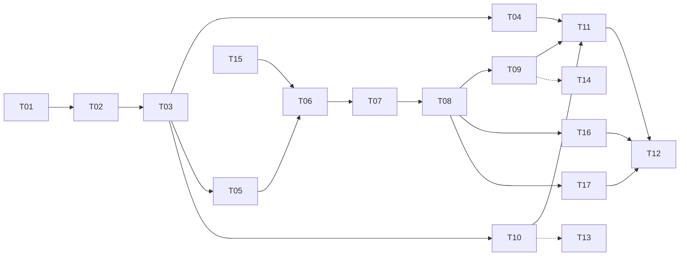

# Octopus 书籍人物 Agent 实施计划

日期：2026 年 10 月 10 日。状态：首版实施计划草案，已同步跨书群聊、秒数配置、圆桌交互与主题 / 自由聊天复核。

目标是逐步交付自动生成人物 Agent、原著知识约束和多人聊天室。共 15 项首版任务与 2 项增强任务，每项包含可演示的用户行为、真正的前置依赖、实施步骤、验收标准和验证场景。权威约束见[详细设计](F:/god/project/Octopus/docs/plans/book-character-agents/detailed-design.md)，背景见[研究报告](F:/god/project/Octopus/docs/research/2026-10-10-book-character-agents.md)。

## 交付顺序与完成标志

| 阶段 | 任务 | 阶段完成时可以演示的行为 |
| --- | --- | --- |
| M1 人物构建 | T01 至 T04 | 准备整本小说，生成有出处的人物名单与 Agent，纠错后产生修订版本 |
| M2 原著约束单聊 | T05 至 T07 | 看清人物知道什么，与其对话，房间记忆可恢复且不改写原著 |
| M3 多人聊天室 | T08、T09、T16、T17 | 独立 Tab 中圆桌落座、右侧对话及头顶气泡同步；跨书回应、@、禁言移除、全体队列与恢复有效 |
| M4 自动化与首版交付 | T10 至 T12 | 导入触发构建、恢复任务、管理版本与删除，两部书籍的单聊与混聊通过验收 |
| 秒数设置 | T15，已完成设置与持久化 | 用户在设置页保存和回读普通/全体时间上限 |
| 后续增强 | T13、T14 | 更多书籍格式、长书检索与调用预算优化 |

阶段是交付分组，不要求整个阶段串行。T03 完成后 T04、T05 与 T10 可以分别推进；M4 的自动导入任务不需要等多人聊天室完成。需要并行实施时使用隔离分支并先稳定接口，当前文档工作不创建并行代码任务。

## 任务索引与依赖

| 任务 | 用户可见交付 | 直接依赖 | 阶段 |
| --- | --- | --- | --- |
| [T01](F:/god/project/Octopus/docs/plans/book-character-agents/tasks/01-narrative-source.md) | 在书目中准备可定位的全文来源 | 无 | M1 |
| [T02](F:/god/project/Octopus/docs/plans/book-character-agents/tasks/02-character-discovery.md) | 手动构建全书人物候选名单 | T01 | M1 |
| [T03](F:/god/project/Octopus/docs/plans/book-character-agents/tasks/03-evidence-persona-agents.md) | 生成有原著证据的人物档案与 Agent | T02 | M1 |
| [T04](F:/god/project/Octopus/docs/plans/book-character-agents/tasks/04-evidence-corrections.md) | 纠正人物身份与依据并发布修订版本 | T03 | M1 |
| [T05](F:/god/project/Octopus/docs/plans/book-character-agents/tasks/05-scoped-knowledge.md) | 查询人物知道什么并查看原著依据 | T03 | M2 |
| [T06](F:/god/project/Octopus/docs/plans/book-character-agents/tasks/06-bounded-single-chat.md) | 与人物进行受原著约束的单聊 | T05、T15 | M2 |
| [T07](F:/god/project/Octopus/docs/plans/book-character-agents/tasks/07-room-memory.md) | 保留房间记忆并支持独立重置 | T06 | M2 |
| [T08](F:/god/project/Octopus/docs/plans/book-character-agents/tasks/08-multi-character-room.md) | 创建跨书多人房间并进行定向与自然回应 | T07 | M3 |
| [T09](F:/god/project/Octopus/docs/plans/book-character-agents/tasks/09-all-participants-control.md) | 向全体提问并控制可恢复的发言队列 | T08 | M3 |
| [T10](F:/god/project/Octopus/docs/plans/book-character-agents/tasks/10-automatic-import-build.md) | 导入小说后自动构建人物并恢复后台任务 | T03 | M4 |
| [T11](F:/god/project/Octopus/docs/plans/book-character-agents/tasks/11-source-lifecycle.md) | 处理书籍版本更换与删除后的房间状态 | T04、T09、T10 | M4 |
| [T12](F:/god/project/Octopus/docs/plans/book-character-agents/tasks/12-mvp-acceptance.md) | 完成首版回归评测与开关发布 | T11、T16、T17 | M4 |
| [T13](F:/god/project/Octopus/docs/plans/book-character-agents/tasks/13-epub-txt-support.md) | 扩展 EPUB 与 TXT 的导入和人物构建 | T10 | 增强 |
| [T14](F:/god/project/Octopus/docs/plans/book-character-agents/tasks/14-retrieval-performance.md) | 增强长书检索与控制多人调用成本 | T09 | 增强 |
| [T15](F:/god/project/Octopus/docs/plans/book-character-agents/tasks/15-chat-timeout-settings.md) | 配置人物聊天室时间上限并持久化 | 无 | 设置 |
| [T16](F:/god/project/Octopus/docs/plans/book-character-agents/tasks/16-roundtable-chat-ui.md) | 独立聊天室 Tab、3D 圆桌与同步气泡 | T08 | M3 |
| [T17](F:/god/project/Octopus/docs/plans/book-character-agents/tasks/17-discussion-modes.md) | 主题 / 自由聊天、讨论配置和轮次快照 | T08 | M3 |

以下为直接依赖；由依赖链已覆盖的前置任务不重复列出。T13 与 T14 不阻塞首版验收。



T15 的设置与持久化已完成。当前可开始 T01；T06 仍等待 T05 的人物受限检索，随后读取 T15 已有的秒数设置。任务完成只表示其验收范围生效，不能据此把未完成的自动构建、知识约束或群聊标为已支持。

## 每项任务的执行方式

1. 读取详细设计、对应任务与其前置任务的完成记录，确认公共接口已存在。
2. 用最小完整样本定义行为测试，在临时工作区验证数据库、服务端和模型输入边界。
3. 完成这条用户行为涉及的存储、服务、协议与界面；每次迁移为新增步骤，不改已执行迁移。
4. 跑与改动相符的测试和前端构建，演示任务交付，记录限制。
5. 将该任务的代码、必要测试和文档作为可独立审查的提交；前置未完成或验收未通过时不宣称 ready。

不用一次把全部数据表、全部 UI 或所有 Agent 配置写完再串联。T01 仅建立来源所需表，T02 增加候选与构建表，T03 增加原著知识表，T06 才增加房间基础表，后续阶段按实际行为扩展。

## 建议的代码接入图

以下新增路径是实施建议，尚未创建生产代码。实际路径若调整，必须保持接口和测试边界；逐任务正文不绑定内部文件路径。

拟新增的服务包为 backend/services/book_world，公开入口集中在 __init__.py；将来源解析、构建、原著查询和房间调度分成小模块。存储可按 build_store、canon_store 和 room_store 分开，避免单个仓储文件过大。模型适配不复用 LibraryChatAgent 的通用工具映射。

| 任务 | 新增职责或接口 | 现有接入点 |
| --- | --- | --- |
| T01 | source、来源与片段存储、来源准备 Handler、原文定位面板 | [library_engine.py](F:/god/project/Octopus/backend/services/library_engine.py:1432)、[knowledge_migrations.py](F:/god/project/Octopus/backend/services/knowledge_migrations.py:627)、[LibraryItemDetail.jsx](F:/god/project/Octopus/frontend/src/pages/Knowledge/library/LibraryItemDetail.jsx:28) |
| T02 | build、worker、extraction、构建与人物候选存储、人物列表 | [registry.py](F:/god/project/Octopus/backend/channels/desktop/handlers/registry.py:210)、[protocol.py](F:/god/project/Octopus/backend/channels/desktop/protocol.py:78)、[schemas.py](F:/god/project/Octopus/backend/channels/desktop/schemas.py:8) |
| T03 | canon_store、构建证据校验、人物基线与运行策略、详情与引用 | [LLMProvider](F:/god/project/Octopus/backend/core/providers/base.py:45)、[LibraryTab.jsx](F:/god/project/Octopus/frontend/src/pages/Knowledge/library/LibraryTab.jsx:22) |
| T04 | evidence_bound_revision、候选合并与修订发布、纠错界面 | 新人物详情与构建接口 |
| T05 | knowledge、AllowlistedContext、中文词项索引、知识依据预览 | [现有片段检索](F:/god/project/Octopus/backend/services/library_engine.py:1530) 作为对照，不直接复用其全局查询 |
| T06 | runtime、reply_validator、provider_resolver、room_store、单聊面板 | [provider factory 的调用方式](F:/god/project/Octopus/backend/agent/library_chat_agent.py:366)、[LibraryChatDrawer.jsx](F:/god/project/Octopus/frontend/src/pages/Knowledge/library/LibraryChatDrawer.jsx:1) 的展示样式 |
| T07 | typed_room_summary、房间重置与 epoch、新人物聊天 Hook | [useChat.js](F:/god/project/Octopus/frontend/src/pages/Knowledge/hooks/useChat.js:1) 的传输模式，独立实现多人状态 |
| T08 | coordinator、成员管理、directed/natural 策略、人物消息列表 | 新 book_room Handler 与单聊房间服务 |
| T09 | 持久队列、租约与 cursor、停止继续、断线补拉 | [WebSocket Handler 基类](F:/god/project/Octopus/backend/channels/desktop/handlers/base.py:14)、[DesktopChannel](F:/god/project/Octopus/backend/channels/desktop/channel.py:267) |
| T10 | 自动构建意图、来源就绪检查、启动补偿、构建恢复 | [library_create](F:/god/project/Octopus/backend/channels/desktop/handlers/library.py:112)、[LibraryImportModal.jsx](F:/god/project/Octopus/frontend/src/pages/Knowledge/library/LibraryImportModal.jsx:41) |
| T11 | 来源失效、版本快照、缓存与工作器生命周期、只读房间 | [删除书目](F:/god/project/Octopus/backend/services/library_engine.py:510)、[服务 lifespan](F:/god/project/Octopus/backend/api/server.py:29) |
| T12 | 验收入口、特性开关、评测记录、迁移与回滚说明 | [pyproject.toml](F:/god/project/Octopus/pyproject.toml:11)、[frontend/package.json](F:/god/project/Octopus/frontend/package.json:6) |
| T13 | EPUB/TXT 解析、附件与原文阅读分支 | [library_upload.py](F:/god/project/Octopus/backend/api/routes/library_upload.py:16)、现有附件管理 |
| T14 | 允许集语义检索、固定依据缓存、usage 与预算控制 | 新 knowledge、worker 和 coordinator 接口 |
| T16 | book-rooms 页面、useBookRoom、BookRoomScene/Canvas、头顶 DOM 气泡与座位分配 | [App.jsx](F:/god/project/Octopus/frontend/src/App.jsx)、[LibrarySceneCanvas.jsx](F:/god/project/Octopus/frontend/src/pages/Knowledge/library/scene/LibrarySceneCanvas.jsx)、现有 Babylon.js 依赖 |
| T17 | set_discussion、讨论 revision、轮次快照、主题上下文与模式控件 | 新 room_store、coordinator、book_room Handler 和房间页面 |

人物用专用 book_world / book_room 协议，不把多人消息塞入原 library_chat 的单 Agent 配置字段。无需重构旧知识库图谱，也不将工作流 KnowledgeService 占位接口作为依赖。

## 先固定的接口与行为

为了让人物纠错、受限查询和自动导入可以独立推进，T03 完成时必须固定：

- PublishedBuild：来源与配置版本、完整或部分发布状态、有效人物名单。
- CharacterIdentity：book_id、source_version_id、build_id、character_id、lineage_id、Agent 状态与固定基线。
- CanonicalClaim：断言类型、所属人物、有效状态、依据与修正关系。
- CharacterAccess：获知路径及证据，不接受客户端或模型直接声明权限。
- SourceLocator：book_id、来源版本、片段与规范化偏移；PDF 页内定位单独记录。

T06 完成时固定 RoomSnapshot、RoomSourceBinding、MemberScope、RoundSnapshot、发布消息身份与序号、client_turn_id、epoch 与 membership_generation。后续多人任务扩展成员与队列，不重写已存在的单聊语义。

人物与聊天室新表位于工作区知识数据库；全局 app.db 保存模型及时间默认偏好，工作区保存运行快照。异步调用不持有数据库事务，工作器使用显式根路径和独立连接，不共享 LibraryEngine 的连接对象执行跨线程写入。

## 跨书群聊与成员控制

首版允许同一工作区内多书混聊。房间不再绑定一个全局 B；每个成员绑定各自的 room_source 和人物，原著检索及消息原著引用按该成员 B 校验，公共历史按 R 共享。每房每书固定一个构建；同书多个译本或构建对比暂不混入同一房间。

成员有 auto、mention_only、muted 三种发言模式。mute 后仍在场但不能回应，包括 @；remove 将 active 置零，仅影响本房间。控制操作可以在运行中发生，必须递增 membership_generation 并撤销该成员未发布的槽位；解禁或重新加入不能恢复旧授权。新来源与新成员仅在轮次空闲时加入。

自然模式默认至多三人，单独 @ 使用 member_id，@全体明确记录禁言或来源失效的跳过原因。公开消息不是自动唤醒全员的触发器，本轮结束等待用户。来源删除只禁用该书成员，保留其他来源的队列和回复；没有可用来源才使房间只读。

T06 建立通用来源绑定；T08 实现跨书选择、同名 @ 和成员控制；T09 实现混合队列与控制竞争；T11 验证部分来源删除；T12 同时验收同书和跨书边界。

## Agent 复核与两种讨论方式

理论映射见[复核报告](F:/god/project/Octopus/docs/plans/book-character-agents/agent-design-review.md)。T03 在已有断言与基线结构中加入有据的动机/价值槽位，证据不足保持 unknown；T06 明确对话行为和情绪触发消息的校验。论文提供设计参考，不构成当前模型零越界或完整认知模拟的证明。

T17 在 T08 基础上实现 free/topic，与 natural/directed/all 发言方式独立。先落实房间配置、revision 和旧库 free 默认；再固定服务端轮次快照与主题上下文；最后接入界面和六种模式联调。T09 的全体/恢复及 T16 的圆桌集成在 T12 验收，T12 增加 T17 为直接依赖。

同一房间可以换模式和主题，保留成员、座位和当前 epoch 的公共记忆；活跃或暂停轮次尚未结束时禁止修改。继续旧轮沿用原讨论快照，新轮读取当前配置；两个讨论方式均使用既有秒数、禁言及有限队列规则，不自动续轮。

## 圆桌界面实施

新入口为与林间图书馆并列的“人物聊天室”Tab，采用左侧 3D 圆桌、右侧完整消息和输入栏。具体布局、状态、座位与气泡投影规则见[圆桌交互设计](F:/god/project/Octopus/docs/plans/book-character-agents/roundtable-ui-design.md)。

T16 拆为三次可演示交付：先实现路由、房间选择、持久座位和圆桌落座；再接入真实已发布消息与头顶同步气泡；最后完成 @、禁言移除、恢复、窄屏与 WebGL 降级。可以先用固定快照制作场景样稿，但必须完成 T08 服务联调才能标记任务完成。T09 的全体队列和续时控制接入同一右栏，T12 等待 T11 和 T16。

服务端保管 member_id 与 seat_index，房间保存布局版本和容量。移除保留空椅，重返/重置不改座位；人数增加只在空闲时扩容，不将 8 座展示默认值当作成员上限。迁移给既有成员一次性回填稳定座位，并建立房间内唯一约束。

useBookRoom 统一接收快照和去重消息，场景仅拿公开投影。生成时先显示状态气泡，message_published 后右栏与气泡使用同 message_id/seq 同步显示校验正文；逐字效果仅为展示动画。迟到进度不驱动正文，重连补拉不批量重播历史气泡。

复用林间图书馆的 Babylon.js 依赖、木桌椅及材质风格，renderer 独立管理 GPU，不承担模型和房间业务。生产构建与操作验收覆盖 1/4/8/16/32 人、资源释放、遮挡、长中文、控制竞争和原有林间图书馆回归。当前仅更新设计，尚未实现该 Tab 或场景。

## 时间设置实施

T15 的设置界面、保存回读、恢复默认、输入校验和旧库兼容已实现。实际计时、超时暂停及继续的最新值读取仍由 T06/T09 接入，偏好保存测试不代表运行时计时完成。

T15：在既有“设置 → 图书馆”中增加普通轮次和全体提问上限，分别默认 60 秒与 300 秒，接受自定义正整数秒。两项保存在全局 agent_defaults，扩展现有读取、更新和前端映射，旧请求保留原值。迁移草案见[timeout-settings.sql](F:/god/project/Octopus/docs/plans/book-character-agents/timeout-settings.sql)。

T15 已交付设置保存、刷新回读、恢复默认和非法值拒绝。T06 读取并快照所选模式上限，单聊即有基本时间限制；T09 完成暂停续时、剩余队列和计时竞争。T12 验收用户真实设置与两种模式的端到端应用。

时间是每次执行窗口上限，不是保证回复速度。计时包括检索、生成与校验，暂停或中断不耗用窗口；超时拒绝迟到发布。手动继续读取最新配置，重置本窗口用时并保留累计用时，不能自动续时。

全局设置迁移与工作区轮次字段迁移分别执行，不对真实库直接运行设计 SQL。全局设置没有跨库外键，运行快照只含非敏感整数与审计用时，不改变人物及原著数据。

## 存储落实与迁移分批

以[详细设计](F:/god/project/Octopus/docs/plans/book-character-agents/detailed-design.md)的存储维度和[SQL 结构草案](F:/god/project/Octopus/docs/plans/book-character-agents/storage-schema.sql)为统一契约。25 张业务表与 FTS5 索引按任务分批落地，不在 T01 执行整份草案。复合父键、子外键、作用域必填、对应索引与保护触发器在同一批迁移中加入，避免先靠应用约定、最后再补隔离。

| 首次落地任务 | 表与约束 | 隔离验收 |
| --- | --- | --- |
| T01 | book_books、book_source_versions、book_segments；来源唯一组合、片段 ordinal、来源不可变与最小删除禁用 | 同一书籍的不同附件或解析版本不混用；原文尾部和短对白保留 |
| T02 | book_builds、book_build_steps、book_scenes、book_scene_segments、book_characters、book_character_aliases、book_scene_characters | 场景片段与人物绑定同书同来源同构建；同名别名允许歧义 |
| T03 | book_claims、book_evidence、book_claim_access、book_access_evidence、book_character_baselines；原文位置、私有人格所有权、发布冻结 | 不能授权他人人格项；可见引文属于该人物与该断言；基线只能引用本人权限 |
| T04 | 使用修订构建及父版本复合外键，不修改已发布原著 | 父版本必须同来源；旧房间使用的构建保持不变 |
| T05 | book_claims_fts 与同步触发器；CanonicalScope 查询和人物允许集索引 | 联接允许集后才排序与 LIMIT；无证据、降级和缓存不扩大范围 |
| T15 | app.db 的 agent_defaults 新增两项正整数秒字段；设置加载、保存、校验与默认值 | 刷新和重启仍可回读，非法输入不修改已有偏好 |
| T06 | book_rooms、book_room_sources、book_room_epochs、book_room_members、book_room_rounds、book_round_slots、book_room_messages、book_message_refs | 单聊也建立来源绑定和槽位；成员以自己的 B 匹配来源绑定与人物，消息及引用匹配发言者，另记录时间快照与当前窗口用时 |
| T07 | book_room_summaries、book_summary_sources；重置事务与 state_epoch | 摘要与听说只引用同 room_id＋epoch；旧代数保留时也不可读入当前上下文 |
| T08、T09 | 扩展 T06 已有多来源绑定、成员与槽位；增加即时成员控制，不另建跨书记忆数据库 | 同房间一活跃轮次；时间上限快照、超时暂停、手动新窗口；过期租约或成员授权不能发布 |
| T10 | 在现有来源和构建表增加自动流程及恢复行为 | 工作区、来源和配置指纹固定，补偿扫描不重复创建 |
| T11 | 生命周期禁用、载荷清理和身份元数据保留 | 来源绑定 B 与人物身份保留；只停用该书成员，最后一个可用来源删除后房间才只读 |
| T16 | rooms 的 scene_layout_version/scene_capacity、members 的 seat_index；唯一座位、不可改绑与空闲扩容 | 座位只控制展示；移除/重置不改变原著范围和成员身份 |
| T17 | rooms 的 discussion_mode/topic/goal/revision 与 rounds 的 discussion_snapshot_json；模式/主题一致性、版本更新与快照冻结 | 主题不扩大允许集；换题不改 R；暂停恢复不改原主题 |
| T12 | 汇总迁移、索引与隔离回归 | SQL 结构检查与真实模块、真实模型验收分开报告 |
| T13、T14 | 复用同一来源与作用域，增加格式解析或检索能力 | 新格式、向量、预算与缓存不得绕过既有复合范围 |

B 为 book_id＋source_version_id＋build_id，R 为 room_id＋epoch。book_id 是人物模块的稳定身份，library_item_id 仅映射现有书目；lineage_id、标题、文件路径和模型生成 ID 不承担权限判断。

所有存储入口接收服务端构造的 CanonicalScope 或 RoomScope，工作区选择固定在数据库连接与缓存身份上。原著关联用完整 B 与 character_id，消息和摘要用完整 R；无范围的单 ID 快捷接口不暴露给人物运行时。每个连接在事务前启用 foreign_keys；SQLite 的关联约束不代替 SELECT 的范围条件。新增迁移与校验连接也必须启用外键；复用现有 MigrationRunner 时在 T01 补齐这一连接设置并回归旧迁移。

T06 的单聊已需要 epoch、轮次、槽位、租约与规范化消息引用；T09 是多人队列控制的扩展，不推迟这些基础约束。rooms 与 epochs 的循环外键在同一迁移中创建，房间初始写入使用单事务及延期外键。

重置时取消轮次、增加租约代数、新建 epoch、切换 current_epoch 并清空成员短暂状态，消息 next_seq 不归零。来源删除保留书籍、版本、构建、人物和 room_source 身份，清理原著载荷与版本文件；只停用受影响成员。有其他可用来源的混聊继续，全部来源失效后只读。

## 存储草案检查记录

已运行[结构校验脚本](F:/god/project/Octopus/docs/plans/book-character-agents/storage-schema-check.py)，在 SQLite 3.45.3 的内存库完成 176 项检查。主题/自由修订新增 36 项，覆盖配置、版本、模式组合、快照冻结、暂停恢复和换题保留记忆；原有座位、跨书、成员控制、时间窗口与隔离检查继续通过。最终 foreign_key_check 无错误。

该脚本只连接 :memory:，使用简化的既有书目父表，不接触真实工作区数据库。它验证 SQL 结构和触发器，不代表应用模块、文件清理、工作区切换或真实模型语义已通过验收。

```powershell
python docs/plans/book-character-agents/storage-schema-check.py
```

## 测试夹具与质量样本

从 T01 起提供一个原创短篇的固定样本，含四个可区分人物、多种称呼、短对白、旁白秘密、甲的错误信念与后续修正。另提供超过 100 个片段的长版本，把关键人物或获知事件放在尾部。测试样本不依赖用户立即提供真实书籍。

从 T02 起使用可记录调用输入的 FakeProvider，按阶段返回候选结构。它用来验证服务发送了什么、拒绝了什么、是否发生重复调用；不证明真实模型的人格或事实表现。

T12 再使用用户选定的两部完整书籍与实际模型，建议建立 60 个经人工复核的评测项：12 个可知事实、12 个不可知事实、8 个信念与修正、8 个观念情感场景、8 个房间记忆和 12 个多轮或多人边界场景。该数量是首轮评测配置建议，不是已获得的数据或性能结论。真实书籍选择不会阻塞前面的协议、解析和确定性测试。

评测记录包含书籍与来源哈希、人物构建、模型与策略版本、问题、预期知情与依据、实际答复、判定和调用量。LLM Judge 可辅助分组，关键边界失败由读过原书的人复核。

## 拟新增测试与检查命令

建议测试文件按行为分为 test_book_storage_schema、test_book_source、test_book_build、test_book_persona、test_book_knowledge_scope、test_book_character_runtime、test_book_room_memory、test_book_room_coordinator 与 test_book_world_lifecycle。必要时继续拆小文件，不将全部测试塞入一个集成用例。

下面是代码实施阶段拟新增功能测试的命令；与上方已经执行的 SQL 草案校验分开记录：

```powershell
python -m pytest tests/test_book_storage_schema.py tests/test_book_source.py tests/test_book_build.py -q
python -m pytest tests/test_book_persona.py tests/test_book_knowledge_scope.py tests/test_book_character_runtime.py -q
python -m pytest tests/test_book_room_memory.py tests/test_book_room_coordinator.py tests/test_book_world_lifecycle.py -q
python -m ruff check backend/services/book_world backend/channels/desktop/handlers/book_world.py backend/channels/desktop/handlers/book_room.py
npm run build --prefix frontend
```

测试路径属于拟新增文件，实施后再执行。命令在 F:/god/project/Octopus 工作目录运行；环境缺少测试依赖时先按项目依赖配置补齐。前端当前没有 test 脚本，不预设 npm test 可用。

每项任务运行相关用例，首版集成时再运行完整项目测试并记录既有失败或环境跳过，不能用跳过结果当作功能通过。界面需操作验收：导入、人物名单、依据定位、独立聊天室 Tab、圆桌落座与气泡同步、单聊、多人点名、全体队列、停止、重置、重连和来源删除；覆盖二维降级与林间图书馆回归。

## 可配置的首版运行边界

| 项目 | 首版设计值 |
| --- | --- |
| 构建并发 | 一项构建，先控制资源占用 |
| 自然模式发言人数 | 默认至多三人 |
| 全体模式 | 全体有效成员快照，每人一槽位，没有少数人物的隐式截断 |
| 自动互动轮数 | 每次提交一轮，不自动续轮 |
| 讨论方式 | 默认自由聊天 free；可设置主题聊天 topic，均可自动选人、@ 人物或全体 |
| 候选格式或回复修复 | 最多重试或重写一次，仍失败进入明确失败或未知回复 |
| 人物正文发布 | 经校验后发布，原始 token 内部缓冲；右栏与气泡同消息同步 |
| 圆桌默认容量 | 8 座，可在空闲时扩展；不限制成员和全体队列 |
| 新房间与重置 | 固定原著基线，房间 epoch 独立 |
| 原著检索降级 | 只在允许集合内进行 |
| 普通轮次时间上限 | 默认 60 秒，设置中正整数秒自定义 |
| 全体提问时间上限 | 默认 300 秒，设置中正整数秒自定义 |
| 时间配置生效 | 新轮次或手动继续时保存快照，运行中不改变 |
| 超时行为 | 暂停，保留已发布与剩余队列；继续启动新的有限窗口 |
| 模型和总预算 | 由当前配置与实际 context/usage 决定；超限暂停或明确报错，不丢队列 |

普通/全体执行窗口使用上述秒数默认值及用户配置。模型上下文、生成长度、单次调用超时和租约过期值由实现阶段根据所选模型能力配置；必须显式设置，不能沿用不适合该任务的 provider 默认上限。lease 心跳与过期时间的关系通过竞争测试验证。时间配置使用严格秒数，避免将毫秒误当秒或允许 0 关闭上限。

## 首版验收与回滚

首版完成的判定包含完整用户路径和四项确定性约束：无跨人物或跨工作区取证、无过期结果发布、无重复槽位发言、无聊天回写原著。真实模型表现单独报告可知事实正确率、不可知事实拒绝率、无依据断言、人物表现与多人关联性。

启用顺序为人物名单 → 受限单聊 → 多人房间 → 导入自动构建。开启自动构建前必须通过任务恢复与配置不可用场景。关闭功能开关应停止接收新任务并取消或暂停现有工作，保留已有数据。

迁移采用新增方式并备份工作区数据库；回滚通过关闭入口与工作器实现，保留新增表。首版不要求移除旧 library_chat 或重建已有知识库。

## 当前交付状态

时间配置已落实到现有设置页与后端持久化。验证：20 项实际后端测试通过，Ruff 检查通过，前端生产构建通过。测试使用 .gitignore 的精确例外纳入版本控制范围。群聊运行计时和窗口恢复为 T06/T09 待实施内容。

本次交付为存储细化后的详细设计、实施计划、17 份本地任务草案、领域词汇、SQL 结构草案和内存校验脚本。SQL 附件是设计契约，尚未注册为生产迁移；任务仍为实施草案。圆桌视觉方案 T16 与主题/自由模式 T17 已加入，生产 Tab、角色模型、气泡和两种讨论运行时尚未实现。

docs/ 与 tests/ 当前被 Git 忽略。实施时应仅对本功能需要的文档和测试进行定向纳入，或针对新目录设置精确规则；不要整体取消项目现有忽略策略。首版具体书籍与真实模型质量基线在 T12 的人工验收中补齐。

